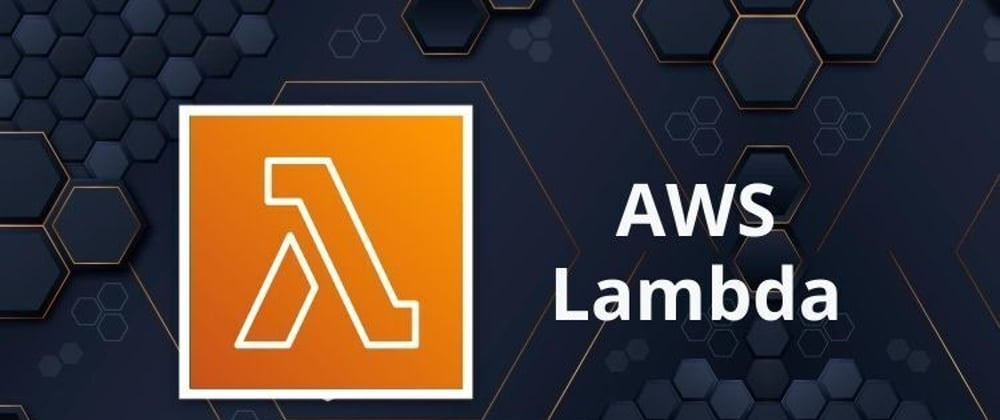

# AWS LAMBDA

    

---

O **AWS Lambda** é um serviço de computação serverless (sem servidor) da Amazon Web Services, que permite executar código em resposta a eventos sem precisar provisionar ou gerenciar servidores. Com o Lambda, você pode carregar o seu código (em várias linguagens, como Node.js, Python, Java, C#, entre outras) e o serviço cuida de toda a infraestrutura necessária para rodá-lo de forma escalável e eficiente.

### Características principais do AWS Lambda:
- **Execução sob demanda**: O Lambda executa o seu código apenas quando um evento ocorre, como uma requisição HTTP via API Gateway, alterações em um bucket S3, mensagens no SNS ou SQS, entre outros.
- **Escalabilidade automática**: O serviço escala automaticamente para lidar com picos de tráfego, sem a necessidade de intervenção manual.
- **Cobrança com base no uso**: A cobrança é feita com base no número de execuções e no tempo de computação consumido, ou seja, você paga apenas pelo que utiliza, sem custos fixos.
- **Sem gerenciamento de servidores**: Como é um serviço serverless, o AWS Lambda abstrai toda a configuração e manutenção de servidores, permitindo que os desenvolvedores foquem exclusivamente no código.
- **Suporte a múltiplas linguagens**: O Lambda oferece suporte a várias linguagens de programação, incluindo Node.js, Python, Ruby, Java, Go, C# (.NET Core), e também possibilita o uso de contêineres customizados.
- **Integração com outros serviços AWS**: Lambda é amplamente integrado com outros serviços da AWS, como API Gateway, DynamoDB, S3, SNS, SQS, CloudWatch, entre outros, o que facilita a criação de arquiteturas serverless complexas.

### Casos de uso comuns:
- **Processamento de dados**: Transformação e análise de dados, como o processamento de imagens, vídeos ou logs.
- **Backends de aplicações web**: Servir como backend para páginas web ou APIs, processando requisições sem a necessidade de servidores dedicados.
- **Automação de tarefas**: Execução de scripts de automação em resposta a eventos, como a criação de arquivos em um bucket S3 ou mensagens em uma fila SQS.
- **Desenvolvimento de microservices**: Construção de microserviços independentes e escaláveis que podem ser facilmente atualizados e mantidos.

Em resumo, o **AWS Lambda** permite que você crie soluções ágeis e escaláveis com baixo custo e sem se preocupar com a infraestrutura, tornando-o uma excelente escolha para desenvolvedores que buscam focar apenas na lógica de aplicação.

[Próximo passo... Arquitetura](./docs/arquitetura.md)